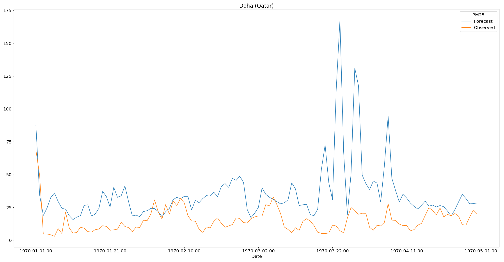
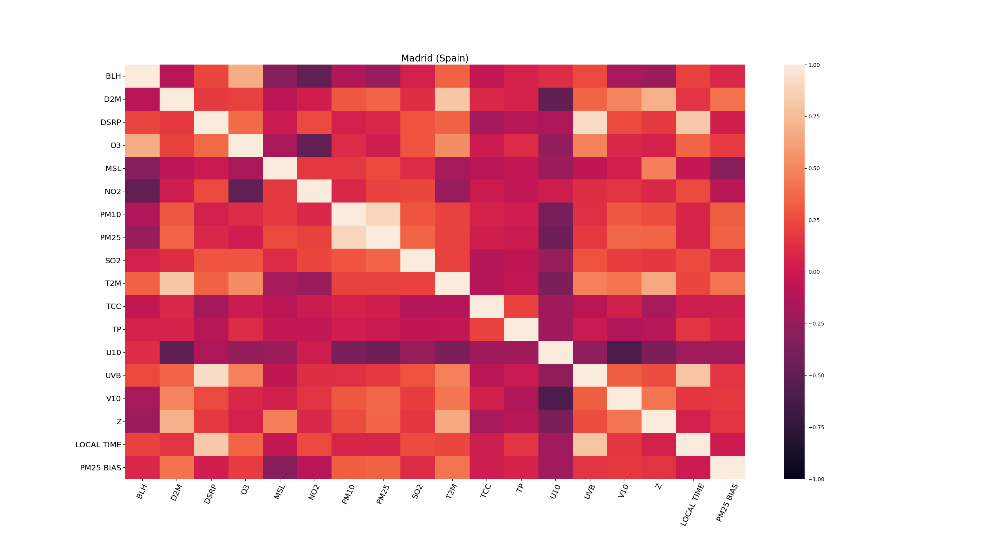
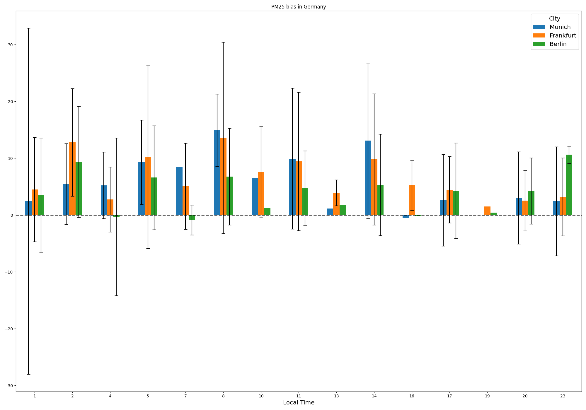

aq-biascorrection
==============================

Bias correction of air quality CAMS model predictions by using OpenAQ observations.

## Data

The data used in this project comes from two different sources. Firstly, the observations from [OpenAQ](https://openaq.org/#/) stations have been downloaded. 

```

```

On the other hand, the forecasts are provided by the CAMS model, which we would like to correct. 

```

```

## Visualizations

Below, several examples of how to generate the different visualizations provided by the repository are shown.

Firstly, a visualization for comparing the observed and predicted values for any given city is presented.

```
plot_station_data pm25 Qatar -s Doha -d data/processed -o reports/figures
```



There is also the possibility to show the correlation between the feature variables and the bias in one heatmap.

```
plot_station_corrs pm25 Spain -s Madrid -d data/processed -o reports/figures
```




Lastly, the dsitribution of the bias by the local time can also be presented as follows.
```
plot_station_hourly_bias pm25 Germany -d data/processed -o reports/figures
```




Project Organization
------------

    ├── LICENSE
    ├── Makefile           <- Makefile with commands like `make data` or `make train`
    ├── README.md          <- The top-level README for developers using this project.
    ├── data
    │   ├── external       <- Data from third party sources.
    │   ├── interim        <- Intermediate data that has been transformed.
    │   ├── processed      <- The final, canonical data sets for modeling.
    │   └── raw            <- The original, immutable data dump.
    │
    ├── docs               <- A default Sphinx project; see sphinx-doc.org for details
    │
    ├── models             <- Trained and serialized models, model predictions, or model summaries
    │
    ├── notebooks          <- Jupyter notebooks. Naming convention is a number (for ordering),
    │                         the creator's initials, and a short `-` delimited description, e.g.
    │                         `1.0-jqp-initial-data-exploration`.
    │
    ├── references         <- Data dictionaries, manuals, and all other explanatory materials.
    │
    ├── reports            <- Generated analysis as HTML, PDF, LaTeX, etc.
    │   └── figures        <- Generated graphics and figures to be used in reporting
    │
    ├── requirements.txt   <- The requirements file for reproducing the analysis environment, e.g.
    │                         generated with `pip freeze > requirements.txt`
    │
    ├── setup.py           <- makes project pip installable (pip install -e .) so src can be imported
    ├── src                <- Source code for use in this project.
    │   ├── __init__.py    <- Makes src a Python module
    │   │
    │   ├── data           <- Scripts to download or generate data
    │   │   └── make_dataset.py
    │   │
    │   ├── features       <- Scripts to turn raw data into features for modeling
    │   │   └── build_features.py
    │   │
    │   ├── models         <- Scripts to train models and then use trained models to make
    │   │   │                 predictions
    │   │   ├── predict_model.py
    │   │   └── train_model.py
    │   │
    │   └── visualization  <- Scripts to create exploratory and results oriented visualizations
    │       └── visualize.py
    │
    └── tox.ini            <- tox file with settings for running tox; 

--------
