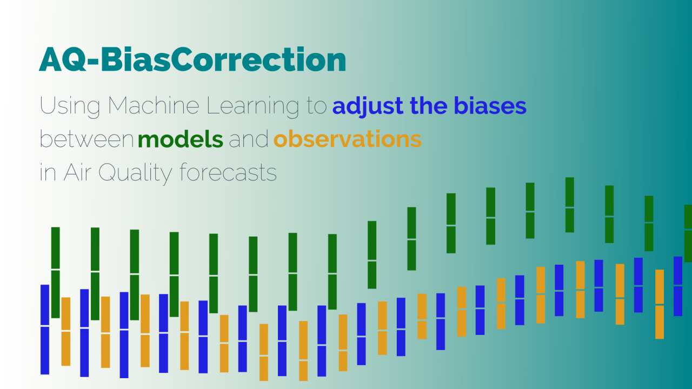

<h1 align="center"> AQ-BiasCorrection </h1>
<h3 align="center"> Bias correction of CAMS model forecasts for air quality variables by using in-situ observations. The bias correction algorithm will mainly be based on ML / DL techniques. </h3>  

</br>

<p align="center"> 
  
</p>

<!-- TABLE OF CONTENTS -->
<h2 id="table-of-contents"> :book: Table of Contents</h2>

<details open="open">
  <summary>Table of Contents</summary>
  <ol>
    <li><a href="#about-the-project">  About The Project</a></li>
    <li><a href="#prerequisites">  Prerequisites</a></li>
    <li><a href="#milestones">  Milestones</a></li>
    <li><a href="#data">  Data</a></li>
    <li>
      <a href="#visualizations">  Visualizations </a>
      <ul>
        <li><a href="#line-plot"> Observed vs forecasted air quality variables </a></li>
        <li><a href="#correlations"> Features correlation</a></li>
        <li><a href="#cdf-bias"> Bias distribution by station</a></li>
        <li><a href="#hourly-bias"> Bias distribution by hour</a></li>
      </ul>
    </li>
    <li><a href="#modelling"> Modelling</a></li>
    <li><a href="#results"> Results </a></li>
    <li><a href="#project-organization"> Project Organization </a></li>
    <li><a href="#faq">  FAQ</a></li>
    <li><a href="#references"> References</a></li>
    <li><a href="#authors"> Authors</a></li>
  </ol>
</details>


<!-- ABOUT THE PROJECT -->
<h2 id="about-the-project"> About the project</h2>


<!-- PREREQUISITES -->
<h2 id="prerequisites">  Prerequisites</h2>


<!-- MILESTONES -->
<h2 id="milestones"> Milestones </h2>

This section is intended to propose a breakdown of the work in a set of weekly milestones (see Figure 3), detailing as much as possible the features studied at each level (this schema could be redesigned during the development stage due to technical problems, commented on following sections).

• **Milestone 1** (*Week 1*): Download of data and analysis of data quality.

• **Milestone 2** (*Week 3*): Preprocess of model predictions, observations and other variables of interest.

• **Milestone 3** (*Week 6*): Initial research about bias distribution. The spatial and temporal distribution will be studied as well as the importance of the variables of interest to differentiate between stations with similar biases.

• **Milestone 4** (*Week 7*): Specification of the model architecture, the selected features and the hyperparameters to tune.

• **Milestone 5** (*Week 8*): Hyperparameter tuning and model training.

• **Milestone 6** (*Week 11*): Validation of trained model and extraction of main insights regarding model ability to correct the bias at each station. A study of the distribution of the errors in the bias prediction.

• **Milestone 7** (*Week 14*): Improvements on model architecture or features
selected based on the insights obtained during the validation stage.

• **Milestone 8** (*Week 16*): Final analysis of the model predictions with the proposed improvements.

• **Milestone 9** (*Week 17*): Final release.


<!-- DATA -->
<h2 id="data"> Data</h2>

The data used in this project comes from two different sources. Firstly, the observations from [OpenAQ](https://openaq.org/#/) stations have been downloaded. 

```

```

On the other hand, the forecasts are provided by the CAMS model, which we would like to correct. 

```

```


<!-- VISUALIZATION -->
<h2 id="visualizations"> Visualizations </h2>


Below, several examples of how to generate the different visualizations provided by the repository are shown.

Firstly, a visualization for comparing the observed and predicted values for any given city is presented.

```
plot_station_data pm25 Qatar -s Doha -d data/processed -o reports/figures
```


There is also the possibility to show the correlation between the feature variables and the bias in one heatmap. The values can be aggregated by its daily mean using the option __-a__ or __--agg_by__.

```
plot_station_corrs no2 Spain -s Madrid -d data/processed -o reports/figures -a daily
```


Addionally, the cumulative distribution function of the bias at each station can be compared for each country, which can also be aggregated daily if desired. The number days with observations is provided in the legend in order to represent  the representativeness of each station sample.

```
plot_station_cdf_bias no2 China -d data/processed -o reports/figures
```


Lastly, the distribution of the bias by the local time can also be presented as follows.
```
plot_station_hourly_bias pm25 Germany -d data/processed -o reports/figures
```


<!-- MODELLING -->
<h2 id="modelling"> Modelling</h2>


<!-- RESULTS -->
<h2 id="results"> Results</h2>


<!-- PROJECT ORGANIZATION -->
<h2 id="project-organization"> :cactus: Project Organization</h2>


    ├── LICENSE
    ├── Makefile           <- Makefile with commands like `make data` or `make train`
    ├── README.md          <- The top-level README for developers using this project.
    ├── data
    │   ├── external       <- Data from third party sources.
    │   ├── interim        <- Intermediate data that has been transformed.
    │   ├── processed      <- The final, canonical data sets for modeling.
    │   └── raw            <- The original, immutable data dump.
    │
    ├── docs               <- A default Sphinx project; see sphinx-doc.org for details
    │
    ├── models             <- Trained and serialized models, model predictions, or model summaries
    │
    ├── notebooks          <- Jupyter notebooks. Naming convention is a number (for ordering),
    │                         the creator's initials, and a short `-` delimited description, e.g.
    │                         `1.0-jqp-initial-data-exploration`.
    │
    ├── references         <- Data dictionaries, manuals, and all other explanatory materials.
    │
    ├── reports            <- Generated analysis as HTML, PDF, LaTeX, etc.
    │   └── figures        <- Generated graphics and figures to be used in reporting
    │
    ├── requirements.txt   <- The requirements file for reproducing the analysis environment, e.g.
    │                         generated with `pip freeze > requirements.txt`
    │
    ├── setup.py           <- makes project pip installable (pip install -e .) so src can be imported
    ├── src                <- Source code for use in this project.
    │   ├── __init__.py    <- Makes src a Python module
    │   │
    │   ├── data           <- Scripts to download or generate data
    │   │   └── make_dataset.py
    │   │
    │   ├── features       <- Scripts to turn raw data into features for modeling
    │   │   └── build_features.py
    │   │
    │   ├── models         <- Scripts to train models and then use trained models to make
    │   │   │                 predictions
    │   │   ├── predict_model.py
    │   │   └── train_model.py
    │   │
    │   └── visualization  <- Scripts to create exploratory and results oriented visualizations
    │       └── visualize.py
    │
    └── tox.ini            <- tox file with settings for running tox; 


<!-- FAQ -->
<h2 id="faq"> :scroll: FAQ</h2>


<!-- REFERENCES -->
<h2 id="references"> References</h2>


<!-- AUTHORS -->
<h2 id="authors"> Authors</h2>

  :boy: <b> Mario Santa Cruz López</b> <br>
  &nbsp;&nbsp;&nbsp;&nbsp;&nbsp; BSc in _Mathematics_ at Universidad de Cantabria <br>
  &nbsp;&nbsp;&nbsp;&nbsp;&nbsp; MSc in _Statistics_ at Imperial College London <br>
  &nbsp;&nbsp;&nbsp;&nbsp;&nbsp; GitHub: <a href="https://github.com/jpxkqx">@jpxkqx</a> <br>
  &nbsp;&nbsp;&nbsp;&nbsp;&nbsp; LinkedIn: <a href="https://www.linkedin.com/in/mariosanta-cruz/">@mariosanta-cruz</a> <br>
  &nbsp;&nbsp;&nbsp;&nbsp;&nbsp; Software developer at <a href="https://predictia.es/"> Predictia Intelligent Data Solutions </a>

  :boy: <b> Antonio Pérez Velasco</b> <br>
  &nbsp;&nbsp;&nbsp;&nbsp;&nbsp; BSc in _Physics_ at Universidad de Cantabria <br>
  &nbsp;&nbsp;&nbsp;&nbsp;&nbsp; MSc in _Data Science_ at Universidad de Cantabria <br>
  &nbsp;&nbsp;&nbsp;&nbsp;&nbsp; Industrial PhD at Universidad de Cantabria <br>
  &nbsp;&nbsp;&nbsp;&nbsp;&nbsp; GitHub: <a href="https://github.com/aperezvelasco">@aperezvelasco</a> <br>
  &nbsp;&nbsp;&nbsp;&nbsp;&nbsp; LinkedIn: <a href="https://www.linkedin.com/in/antonio-perez-velasco/">@antonio-perez-velasco</a> <br>
  &nbsp;&nbsp;&nbsp;&nbsp;&nbsp; Software developer at <a href="https://predictia.es/"> Predictia Intelligent Data Solutions </a>
