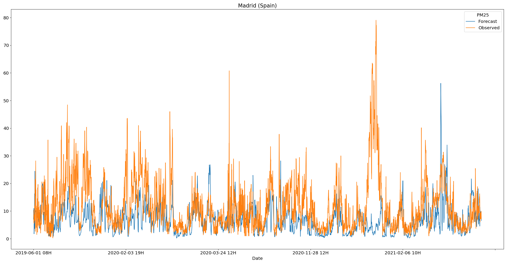

<h1 align="center"> AQ-BiasCorrection </h1>
<h3 align="center"> Bias correction of CAMS model forecasts for air quality variables by using in-situ observations. The bias correction algorithm will mainly be based on ML / DL techniques. </h3>  

[](https://github.com/psf/black) 
 

</br>


<p align="center"> 
  
</p>

<!-- TABLE OF CONTENTS -->
<h2 id="table-of-contents"> :book: Table of Contents</h2>

<details open="open">
  <summary>Table of Contents</summary>
  <ol>
    <li><a href="#about-the-project">  About The Project</a></li>
    <li><a href="#prerequisites">  Prerequisites</a></li>
    <li><a href="#milestones">  Milestones</a></li>
    <li><a href="#data">  Data</a></li>
    <li>
      <a href="#visualizations">  Visualizations </a>
      <ul>
        <li><a href="#line-plot"> Observed vs forecasted air quality variables </a></li>
        <li><a href="#correlations"> Features correlation</a></li>
        <li><a href="#cdf-bias"> Bias distribution by station</a></li>
        <li><a href="#hourly-bias"> Bias distribution by hour</a></li>
      </ul>
    </li>
    <li>
      <a href="#modelling">  Modelling </a>
      <ul>
        <li><a href="#linear-regression"> Linear Regression </a></li>
        <li><a href="#inception-time"> InceptionTime </a></li>
        <li><a href="#gradient-boosting"> Gradient Boosting </a></li>
        <li><a href="#ensemble"> Ensemble </a></li>
      </ul>
    </li>
    <li>
      <a href="#results">  Results </a>
      <ul>
        <li><a href="#linear-regression-results"> Linear Regression </a></li>
        <li><a href="#inception-time-results"> InceptionTime </a></li>
        <li><a href="#gradient-boosting-results"> Gradient Boosting </a></li>
        <li><a href="#ensemble-results"> Ensemble </a></li>
      </ul>
    </li>
    <li><a href="#project-organization"> Project Organization </a></li>
    <li><a href="#faq">  FAQ</a></li>
    <li><a href="#references"> References</a></li>
    <li><a href="#authors"> Authors</a></li>
  </ol>
</details>


<!-- ABOUT THE PROJECT -->
<h2 id="about-the-project"> :blue_book: About the project</h2>

Bias correction of CAMS model forecasts for air quality variables by using 
in-situ observations. The bias correction algorithm will mainly be based on
machine-learning / deep-learning techniques.


<!-- PREREQUISITES -->
<h2 id="prerequisites"> :pushpin: Prerequisites and Installation</h2>

To clone the project:

```
git clone https://github.com/esowc/aq-biascorrection.git
```

To download the extra information (data and models) used during the experimental phase:

```
wget https://cloud.predictia.es/s/gR2menicTwW9nxK/download
```

Create a ".env" file (where the root directory and the credentials for login into the 
Atmosphere Data Store) at the same height as "README.md" following the pattern:
```
# Environment variables go here, can be read by `python-dotenv` package:
#
#   `src/script.py`
#   ----------------------------------------------------------------
#    import dotenv
#
#    project_dir = os.path.join(os.path.dirname(__file__), os.pardir)
#    dotenv_path = os.path.join(project_dir, '.env')
#    dotenv.load_dotenv(dotenv_path)
#   ----------------------------------------------------------------
#
# DO NOT ADD THIS FILE TO VERSION CONTROL!

ROOT_DIR = "/XXXXXXXXX/aq-biascorrection"
ADS_API_KEY = "UID:KEY"
```

The software packages, needed for this software to be able to execute all the different
methods, are defined in the requirements.txt file.

For the environment installation:

```
conda create --name aq-biascorrection python
```

```
conda activate aq-biascorrection
```

```
python -m pip install -r requirements.txt
```

```
pip install . -e
```


<!-- MILESTONES -->
<h2 id="milestones"> :bookmark: Milestones </h2>

This section is intended to propose a breakdown of the work in a set of weekly milestones, detailing as much as possible the features studied at each level (this schema could be redesigned during the development stage due to technical problems, commented on following sections).

• **Milestone 1** (*Week 1*): Download of data and analysis of data quality.

• **Milestone 2** (*Week 3*): Preprocess of model predictions, observations and other variables of interest.

• **Milestone 3** (*Week 6*): Initial research about bias distribution. The spatial and temporal distribution will be studied as well as the importance of the variables of interest to differentiate between stations with similar biases.

• **Milestone 4** (*Week 7*): Specification of the model architecture, the selected features and the hyperparameters to tune.

• **Milestone 5** (*Week 8*): Hyperparameter tuning and model training.

• **Milestone 6** (*Week 11*): Validation of trained model and extraction of main insights regarding model ability to correct the bias at each station. A study of the distribution of the errors in the bias prediction.

• **Milestone 7** (*Week 14*): Improvements on model architecture or features
selected based on the insights obtained during the validation stage.

• **Milestone 8** (*Week 16*): Final analysis of the model predictions with the proposed improvements.

• **Milestone 9** (*Week 17*): Final release.


<!-- DATA -->
<h2 id="data"> :1234: Data</h2>

The data used in this project comes from two different sources.
Firstly, the observations from [OpenAQ](https://openaq.org/#/) stations have
been downloaded for the three variables of interest at a set of interesting 
locations / cities
```
extraction_openaq pm25 -l data/external/stations.csv -o data/interim
```

The stations.csv file must follow the structure:
```
,id,city,country,latitude,longitude,timezone,elevation
```

For instance:
```
,id,city,country,latitude,longitude,timezone,elevation
0,AE001,Dubai,United Arab Emirates,25.0657,55.17128,Asia/Dubai,2
1,AE002,Abu Dhabi,United Arab Emirates,24.46667,54.36667,Asia/Dubai,3
```
In case that there are no available stations in a radius of 100 kilometeres to
the location of interest in the time range selected by the user 
(default: 1-6-2019 to 31-3-2021), no data is downloaded, and an exception
is raised with the message: 
```
- 'There is no data in the time range considered for this location of interest'
- 'There are no stations next to this location in OpenAQ for the variable of interest'
```

In case of successful retrieval, the data for every location / variable
is processed and stored in netcdf format:
```
netcdf pm25_spain_madrid_es001_20190601_20210331 {
dimensions:
        time = 8885 ;
        station_id = 5 ;
variables:
        int64 time(time) ;
                time:units = "hours since 2019-06-01 08:00:00" ;
                time:calendar = "proleptic_gregorian" ;
        double pm25(station_id, time) ;
                pm25:_FillValue = NaN ;
                string pm25:units = "µg/m³" ;
                pm25:standard_name = "pm25" ;
                pm25:long_name = "Particulate matter (PM2.5)" ;
                pm25:coordinates = "y x _x _y distance" ;
        int64 station_id(station_id) ;
                station_id:long_name = "station name" ;
                station_id:cf_role = "timeseries_id" ;
        double x(station_id) ;
                x:_FillValue = NaN ;
                x:units = "degrees_east" ;
                x:long_name = "Longitude" ;
                x:standard_name = "longitude" ;
        double y(station_id) ;
                y:_FillValue = NaN ;
                y:units = "degrees_north" ;
                y:long_name = "Latitude" ;
                y:standard_name = "latitude" ;
        double _x ;
                _x:_FillValue = NaN ;
                _x:units = "degrees_east" ;
                _x:long_name = "Longitude of the location of interest" ;
                _x:standard_name = "longitude_interest" ;
        double _y ;
                _y:_FillValue = NaN ;
                _y:units = "degrees_north" ;
                _y:long_name = "Latitude of the location of interest" ;
                _y:standard_name = "latitude_interest" ;
        double distance(station_id) ;
                distance:_FillValue = NaN ;
                distance:units = "km" ;
                distance:long_name = "Distance" ;
                distance:standard_name = "distance" ;

// global attributes:
                :featureType = "timeSeries" ;
                :Conventions = "CF-1.4" ;
}
```

where (_x, _y) are the coordinates of the location of interest as given in the 
stations.csv file, and (x, y) are the coordinates of the closest stations
downloaded from the [OpenAQ](https://openaq.org/#/) platform 
(taking a maximum of 5 stations). In addition, information about the distance
from the OpenAQ station to the location of interest is provided in kilometers.

For the five stations shown in the file befores, these distances are:
```
 distance = 1.81559141220802, 2.45376657682221, 2.78449016534016, 
 3.2173204331241, 3.7871094512231 ;
```

On the other hand, the forecasts are provided by the CAMS model, 
which we would like to correct. The files have been processed and offered as
part of the project by the ECMWF team. The structure followed was: one file per
variable and initialization time step (3 hour frequency).

```
extraction_cams -i data1/cams_model -intermediary data/interim -l data/external/stations.csv -o data/interim
```

The processed and stored data follows the consequent pattern:
```
netcdf cams_spain_madrid_es001_20190601_20210331 {
dimensions:
        time = 5360 ;
variables:
        int64 time(time) ;
                time:long_name = "time" ;
                time:units = "hours since 2019-06-01 00:00:00" ;
                time:calendar = "proleptic_gregorian" ;
        float longitude ;
                longitude:_FillValue = NaNf ;
                longitude:units = "degrees_east" ;
                longitude:long_name = "longitude" ;
        float latitude ;
                latitude:_FillValue = NaNf ;
                latitude:units = "degrees_north" ;
                latitude:long_name = "latitude" ;
        float blh(time) ;
                blh:_FillValue = NaNf ;
                blh:units = "m" ;
                blh:long_name = "Boundary layer height" ;
                blh:coordinates = "latitude station_id longitude" ;
        string station_id ;
        float d2m(time) ;
                d2m:_FillValue = NaNf ;
                d2m:units = "K" ;
                d2m:long_name = "2 metre dewpoint temperature" ;
                d2m:coordinates = "latitude station_id longitude" ;
        float dsrp(time) ;
                dsrp:_FillValue = NaNf ;
                dsrp:units = "J m**-2" ;
                dsrp:long_name = "Direct solar radiation" ;
                dsrp:coordinates = "latitude station_id longitude" ;
        float go3(time) ;
                go3:_FillValue = NaNf ;
                go3:units = "kg kg**-1" ;
                go3:long_name = "GEMS Ozone" ;
                go3:coordinates = "longitude latitude" ;
        float msl(time) ;
                msl:_FillValue = NaNf ;
                msl:units = "Pa" ;
                msl:long_name = "Mean sea level pressure" ;
                msl:standard_name = "air_pressure_at_mean_sea_level" ;
                msl:coordinates = "latitude station_id longitude" ;
        float no2(time) ;
                no2:_FillValue = NaNf ;
                no2:units = "kg kg**-1" ;
                no2:long_name = "Nitrogen dioxide" ;
                no2:coordinates = "longitude latitude" ;
        float pm10(time) ;
                pm10:_FillValue = NaNf ;
                pm10:units = "kg m**-3" ;
                pm10:long_name = "Particulate matter d < 10 um" ;
                pm10:coordinates = "latitude station_id longitude" ;
        float pm2p5(time) ;
                pm2p5:_FillValue = NaNf ;
                pm2p5:units = "kg m**-3" ;
                pm2p5:long_name = "Particulate matter d < 2.5 um" ;
                pm2p5:coordinates = "latitude station_id longitude" ;
        float so2(time) ;
                so2:_FillValue = NaNf ;
                so2:units = "kg kg**-1" ;
                so2:long_name = "Sulphur dioxide" ;
                so2:coordinates = "longitude latitude" ;
        float t2m(time) ;
                t2m:_FillValue = NaNf ;
                t2m:units = "K" ;
                t2m:long_name = "2 metre temperature" ;
                t2m:coordinates = "latitude station_id longitude" ;
        float tcc(time) ;
                tcc:_FillValue = NaNf ;
                tcc:units = "(0 - 1)" ;
                tcc:long_name = "Total cloud cover" ;
                tcc:standard_name = "cloud_area_fraction" ;
                tcc:coordinates = "latitude station_id longitude" ;
        float tp(time) ;
                tp:_FillValue = NaNf ;
                tp:units = "m" ;
                tp:long_name = "Total precipitation" ;
                tp:coordinates = "latitude station_id longitude" ;
        float u10(time) ;
                u10:_FillValue = NaNf ;
                u10:units = "m s**-1" ;
                u10:long_name = "10 metre U wind component" ;
                u10:coordinates = "latitude station_id longitude" ;
        float uvb(time) ;
                uvb:_FillValue = NaNf ;
                uvb:units = "J m**-2" ;
                uvb:long_name = "Downward UV radiation at the surface" ;
                uvb:coordinates = "latitude station_id longitude" ;
        float v10(time) ;
                v10:_FillValue = NaNf ;
                v10:units = "m s**-1" ;
                v10:long_name = "10 metre V wind component" ;
                v10:coordinates = "latitude station_id longitude" ;
        float z(time) ;
                z:_FillValue = NaNf ;
                z:units = "m**2 s**-2" ;
                z:long_name = "Geopotential" ;
                z:standard_name = "geopotential" ;
                z:coordinates = "latitude station_id longitude" ;

// global attributes:
                :Conventions = "CF-1.6" ;
                :history = "2021-05-13 16:28:04 GMT by grib_to_netcdf-2.19.1: grib_to_netcdf -D NC_FLOAT -k3 -o ./input_data/hcn9/z_cams_c_ecmf_20190601_hcn9_fc_ml137_000_blh.nc.tmp ./input_data/hcn9/z_cams_c_ecmf_20190601_hcn9_fc_ml137_000_blh.grib" ;
}

```

Once the data from the forecasts and observations is steady in place, they
are merged into a unique pd.DataFrame for each location of interest in which 
both of them are available.

```
transform_data pm25 -l data/external/stations.csv -o data/processed
```


A .csv file is stored for each location of interest with the following name:
`data/processed/{variable}/data_{variable}_{location_id}.csv`

and the following pattern:
```
,index,blh_forecast,d2m_forecast,dsrp_forecast,o3_forecast,msl_forecast,no2_forecast,pm10_forecast,pm25_forecast,so2_forecast,t2m_forecast,tcc_forecast,tp_forecast,u10_forecast,uvb_forecast,v10_forecast,z_forecast,pm25_observed,local_time_hour,pm25_bias
0,2019-08-20 09:00:00,607.5200805664062,295.787353515625,2751658.666666666,92.31901583552234,100358.6875,46.60620273757936,96.03606479780699,45.14446319682656,14.990726261869126,310.6859436035156,0.00030517578125,0.0,2.1806488037109375,329045.3333333334,1.7370452880859375,57955.546875,46.0,13,-0.8555368031734432
1,2019-08-20 10:00:00,553.0756632486979,296.65240478515625,2710528.0,100.0631568771554,100300.45833333333,59.867852416089804,95.6658838697942,45.18626472314821,16.8662672354812,310.4251200358073,0.0003560384114583333,0.0,2.716400146484375,304298.66666666674,-0.005783081054687722,57927.919270833336,89.0,14,-43.81373527685179
2,2019-08-20 11:00:00,498.63124593098956,297.5174560546875,2710528.0,107.81134804645772,100242.22916666667,73.13640423978323,95.29553961138413,45.228101565972075,18.74278688256282,310.16429646809894,0.00040690104166666663,0.0,3.2521514892578125,304298.6666666666,-1.748611450195313,57900.291666666664,65.0,15,-19.771898434027925
```

Some interesting highlights to mention about this transformation section:

- Time interpolation has been performed to the forecast (3 hourly) data in order
  to have 1h frequency data. For the same purpose, a resampling has been 
  performed to the observations (average of the available observations over an
  hour).
  
- For the observations with more than one stations available (maximum of five), 
  a weighted average has been performed as a function of the distance to the 
  location of interest.

- The units are in different format for the observations (μg / m³) and 
  the forecast (kg / kg). In order to take the best approach: elevation,
  temperature and mean sea level pressure have been used with the ideal
  gas equation to obtain the air density at a given time step and transform the 
  corresponding kg / kg to μg / m³. This process has been taken into 
  consideration for `pm25` and `no2` variables, due to the fact that `o3`
  observations are given in `ppm` by the OpenAQ platform. Similar approach is 
  driven.
    
- Some variables [`dsrp`, `tp`, `uvb`] are accumulated during the day 
  (i.e, the precipitation at the 24h is the sum of the other 
  23 hours + the 24th hour), so they have been disaggregated during the process.
  


<!-- VISUALIZATION -->
<h2 id="visualizations"> :art: Visualizations </h2>


Below, several examples of how to generate the different visualizations provided by the repository are shown. All visualizations generated can be accesed from [http://185.226.253.38/](http://185.226.253.38/).

Firstly, a visualization for comparing the observed and predicted values for any given city is presented.

```
plot_station_data pm25 Spain -s Madrid -d data/processed -o reports/figures
```




There is also the possibility to show the correlation between the feature variables and the bias in one heatmap. The values can be aggregated by its daily mean using the option __-a__ or __--agg_by__.

```
plot_station_corrs no2 Spain -s Madrid -d data/processed -o reports/figures -a daily
```


Addionally, the cumulative distribution function of the bias at each station can be compared for each country, which can also be aggregated daily if desired. The number days with observations is provided in the legend in order to represent  the representativeness of each station sample.

```
plot_station_cdf_bias pm25 Madrid -d data/processed -o reports/figures
```


Lastly, the distribution of the bias by the local time can also be presented as follows.
```
plot_station_hourly_bias pm25 Spain -d data/processed -o reports/figures
```


<!-- MODELLING -->
<h2 id="modelling"> Modelling</h2>

The main task of this project is to predict the CAMS bias in the following M predictions based on the CAMS predictions in the past N predictions, and the OpenAQ stations attributes. 


<h3 id="linear-regression"> Linear Regression </h3>

The [ElasticNet](https://scikit-learn.org/stable/modules/generated/sklearn.linear_model.ElasticNet.html#sklearn.linear_model.ElasticNet) interface from scikit-learn has been used for model selection of the best regression model, where the parameters alpha and l1_ratio are selected by grid search cross validation in the the training dataset. The linear regression, the lasso regression and the ridge regression are particular cases from this model, which are all considered in the model selection procedure.

The l1_ratio take values in [0, 1], and represents the ratio between the l1 loss term and the l2 loss term. On the other hand, the alpha parameter is a multiplying constant for l1 and l2 loss terms. This is implemented in [regression.py](https://github.com/esowc/aq-biascorrection/blob/main/src/models/regression.py)


<h3 id="inception-time"> InceptionTime modified </h3>
  
The [InceptionTime](https://github.com/hfawaz/InceptionTime) model is a neural network used for time series classification with inception modules and residual connections. Its main architecture has been used for extraction of the most relevant features of our CAMS predictions series. A Multi Layer Perceptron (MLP) has been used for the features without temporal variability (for example, hour, month, latitude, longitude or altitude). The output of both modules is passed to another MLP whose last layer is a Dense layer with M neurons.
  
This model has different hyperparameters to tune. The inceptions kernels are set following the results presented in Table 1 of [paper](https://arxiv.org/pdf/1909.04939.pdf). The residuals connections are set as in the preivous study (each 3 inception modules) as well as the bottleneck size. Other parameter is the depth of the network, i.e. number of inception modules. We have train and validated our model for depths values of 3, 6, and 9. Other hyperparameter that has been changed is the number of filter m << M, where M=17 is the number of temporal features. So, 4 filters are used in each case. This is implemented in [inception_time.py](https://github.com/esowc/aq-biascorrection/blob/main/src/models/inception_time.py).


<h3 id="gradient-boosting"> Gradient Boosting </h3>

Gradient Boosting is a supervised algorithm that refers to the ensemble of several decision trees which is implemented in [gradient_boosting.py](https://github.com/esowc/aq-biascorrection/blob/main/src/models/gradient_boosting.py). A particular implementation of gradient boosting is [XGBoost](https://xgboost.readthedocs.io/en/latest/), which improves:

- **Model performance** because it introduces regularization techniques)
- **Model efficency** because of its ease of parallelization.

<h3 id="ensemble"> Ensemble of models </h3>

Lastly, the models which prove to correct reasonably well the bias in the CAMS forecast will be aggregate together.

For training a model succesfully is necessary a .yml file with the model/s configuration/s as follows:

```buildoutcfg
data:
  variable: pm25
  idir: data/processed/
  odir: models/weights_storage/
  n_prev_obs: 24
  n_future: 24
  min_station_observations: 240
models:
  - name: InceptionTime
    type: inception_time
    model_ensemble: 5
    model_selection: False
    model_parameters:
      inception_kernels: [2, 4, 8]
      depth: 6
      n_filters: 4
      batch_size: 128
      n_epochs: 150
      bottleneck_size: 4
      verbose: 2
    training_method:
      cv: 4
      scoring: neg_mean_absolute_error
      n_jobs: 1
      verbose: 2
```

This is the one that has been taken for our final results, but you can create your own one in 
order to test other algorithms.

- variable = name of the variable to train (pm25, no2, o3)
- idir = directory where the data is stored
- odir = directory where the user wants to store the model weights
- n_prev_obs = number of previous hours taken
- n_future = number of future hours taken

In this case 48h are taken in total (from t-24 to t+24) of CAMS forecasting model to predict the
t+24h errors.

- min_station_observations = number of minimum observations gathered by an station to be considered as a valid one

There are only three models implemented so far:
```
models_dict = {
    "gradient_boosting": GradientBoosting,
    "inception_time": InceptionTime,
    "elasticnet_regressor": ElasticNetRegr,
}
```
The keys of the dictionary shown above represent the different possibilities to use in the "type"
field of the configuration file.

For the model parameters, the user need to specify the same model parameters as 
the selected model class has (for this, it will be necessary to drive through the code in
src/models/*.py):

```
class InceptionTime:
    output_dims: int = 1
    depth: int = 6
    n_filters: int = 32
    batch_size: int = 64
    n_epochs: int = 200
    inception_kernels: List[int] = field(default_factory=lambda: [2, 4, 8])
    bottleneck_size: int = 32
    verbose: int = 2
    optimizer: str = "rmsprop"
    loss: str = "mae"
    metrics: List[str] = field(default_factory=lambda: ["rmse"])
```

For training the model, run this command:
```
model_train -c models/configuration/config_inceptiontime_depth6.yml
```


<!-- RESULTS -->
<h2 id="results"> :trophy: Results</h2>

For running the model validation, the following command is run:

```
model_validation pm25 InceptionTime -l data/external/stations.csv -ov reports/figures/results
-or reports/tables/results
```

It will create figures and tables as part of the validation process. For instance, these are the figures generated
for the case of the station located at Glasgow for the O3 variable:


<!-- PROJECT ORGANIZATION -->
<h2 id="project-organization"> :open_file_folder: Project Organization</h2>


    ├── LICENSE
    ├── Makefile             <- Makefile with commands like `make data` or `make train`
    ├── README.md            <- The top-level README for developers using this project.
    ├── data
    │   ├── external         <- Data from third party sources.
    │   ├── interim          <- Intermediate data that has been transformed.
    │   ├── processed        <- The final, canonical data sets for modeling.
    │   └── raw              <- The original, immutable data dump.
    │
    ├── docs                 <- A default Sphinx project; see sphinx-doc.org for details
    │
    ├── models               <- Trained and serialized models, model predictions, or model summaries
    │
    ├── notebooks            <- Jupyter notebooks. Naming convention is a number (for ordering),
    │                         the creator's initials, and a short `-` delimited description, e.g.
    │                         `1.0-jqp-initial-data-exploration`.
    │
    ├── references           <- Data dictionaries, manuals, and all other explanatory materials.
    │
    ├── reports              <- Generated analysis as HTML, PDF, LaTeX, etc.
    │   └── figures          <- Generated figures with processed data as well as with the model results
    |   └── images           <- Generated images to use in the GitHub repository documentation. 
    |   └── tables           <- Generated tables with the model results. 
    │
    ├── requirements.txt     <- The requirements file for reproducing the analysis environment, e.g.
    │                         generated with `pip freeze > requirements.txt`
    │
    ├── setup.py             <- makes project pip installable (pip install -e .) so src can be imported
    ├── src                  <- Source code for use in this project.
    │   ├── __init__.py      <- Makes src a Python module
    |   ├── constants.py     <- Constant values used in the project
    │   │
    │   ├── data             <- Scripts to download or generate data
    |   |   ├── __init__.py
    |   |   ├── utils.py
    |   |   |
    |   |   ├── extraction
    |   |   |   ├── __init__.py
    |   |   |   ├── cams_forecast.py
    |   |   |   └── openaq_obs.py
    |   |   |
    |   |   ├── load
    |   |   |   ├── __init__.py
    |   |   |   └── load_data.py
    |   |   |
    │   │   └── transformation
    |   |       ├── __init__.py
    |   |       ├── transformation_data.py
    |   |       └── transformation_location.py
    |   | 
    |   ├── metrics          <- Metrics for model performance evaluation
    |   |   ├── __init__.py
    |   |   ├── utils.py
    │   │   ├── metrics.py
    │   │
    │   ├── models           <- Scripts to train models and then use trained models to make
    │   │   │                   predictions
    |   |   ├── __init__.py
    |   |   ├── utils.py
    │   │   ├── predict_model.py
    │   │   └── train_model.py
    │   │
    │   ├── visualization    <- Scripts to create exploratory and results oriented visualizations
    |   |   ├── __init__.py
    │   |   └── visualize.py
    |   |
    │   └── scripts          <- Scripts create entrypoints for CLI
    |       ├── __init__.py
    |       ├── extraction_cams.py
    |       ├── extraction_openaq.py
    |       ├── plotting.py
    |       ├── transformation_data.py
    │       └── produce_data.py
    │
    ├── tests
    |   ├── __init__.py
    |   |
    |   ├── data                   <- Data used to test package functionalities
    |   |
    |   ├── file_provider.py       <- File handling the provision of test files
    |   |
    |   ├── test_downloader.py     <- Tests of the data acquisition module
    |   |
    |   └── test_visualizations.py <- Test of the visualizations module
    |
    └── tox.ini            <- tox file with settings for running pytest and flake8


<!-- FAQ -->
<h2 id="faq"> :question: FAQ</h2>


<!-- REFERENCES -->
<h2 id="references"> :books: References</h2>


<!-- AUTHORS -->
<h2 id="authors"> :bust_in_silhouette: Authors</h2>

<div>
  <section>
    <ul style="list-style-type:none;" id="a">
      <li>
          
          <p>
            :man: <b> Mario Santa Cruz López</b> <br>
            BSc in <strong>Mathematics</strong> at Universidad de Cantabria <br>
            MSc in <strong>Statistics</strong> at Imperial College London <br>
            GitHub: <a href="https://github.com/jpxkqx">@jpxkqx</a> <br>
            LinkedIn: <a href="https://www.linkedin.com/in/mariosanta-cruz/">@mariosanta-cruz</a> <br>
            Software developer at <a href="https://predictia.es/"> Predictia Intelligent Data Solutions </a> 
          </p>
      </li>
    </ul>
  </section>
  <br>
  <section>
    <ul style="list-style-type:none;" id="b">
      <li>
          
          <p>
            :man: <b> Antonio Pérez Velasco</b> <br>
            BSc in <strong>Physics</strong> at Universidad de Cantabria <br>
            MSc in <strong>Data Science</strong> at Universidad de Cantabria <br>
            Industrial PhD at Universidad de Cantabria <br>
            GitHub: <a href="https://github.com/aperezvelasco">@aperezvelasco</a> <br>
            LinkedIn: <a href="https://www.linkedin.com/in/antonio-perez-velasco/">@antonio-perez-velasco</a> <br>
            Software developer at <a href="https://predictia.es/"> Predictia Intelligent Data Solutions </a>
         </p>
      </li>
    </ul>
  </section>
</div>
